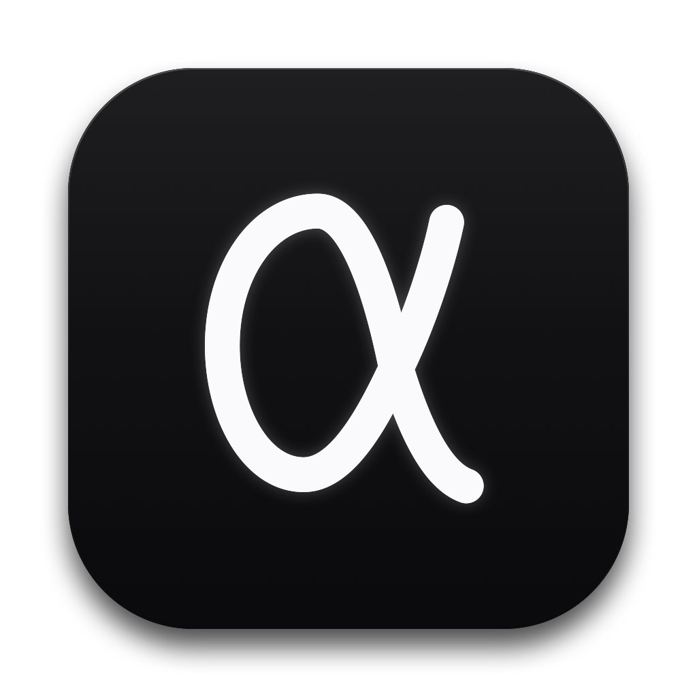

<div align="center">
  
  <h1>AlphaTrack</h1>
  <p><b>macOS 原生行情判断存证 · KOL 预测验真 · 投资认知校准</b></p>
  <p>
    
    
    
    
    
  </p>
  <p>
    <a href="#快速开始">快速开始</a> ·
    <a href="#核心特性">核心特性</a> ·
    <a href="#核心概念">核心概念</a> ·
    <a href="#行情数据源">行情数据源</a> ·
    <a href="#项目结构">项目结构</a> ·
    <a href="#english">English</a>
  </p>
</div>

---

> 记录你和市场对话的每一次判断，然后让时间去验证它。

AlphaTrack 是一款面向**多市场主动投资者**的 macOS 原生桌面工具。它的核心命题很简单：**人的记忆会说谎，K 线不会。**

无论是一条自己盘前闪过的前瞻判断，还是某位博主高调晒出的喊单，只要录入 AlphaTrack，它就会被**锁定基准价、锁定时间戳、锁定到期时刻**，到期后由后台引擎拉真实 K 线自动结算胜负。盈利的单子不会被遗忘，被打脸的单子也不会被删掉 —— 最终沉淀成一张冷冰冰但诚实的胜率表，和一个衡量你认知偏差的人格画像。

**设计哲学**：零云端依赖 · 纯本地私密 · 极速轻量 · 无任何遥测。

---

## 核心特性

### 1. HUD 极速存证 —— 3 秒完成一次记录

任意应用前台按 <kbd>⌥</kbd> + <kbd>A</kbd>，磨砂无边框 `NSPanel` 浮窗从屏幕中央浮现。

- 全局热键基于 **Carbon `RegisterEventHotKey`** 系统级注册，即使当前焦点在访达、浏览器或桌面也能瞬间唤起
- 输入标的自动拉取**实时市价**作为基准价，免手填
- <kbd>⌘</kbd> + <kbd>V</kbd> 直接粘贴剪贴板截图作为证据附件
- 常用 KOL / 券商**来源胶囊**一键点选，不用反复打字
- <kbd>⌘</kbd> + <kbd>↵</kbd> 保存，<kbd>Esc</kbd> 关闭

### 2. 多空预测 与 客观数据「双轨制」

这是 AlphaTrack 区别于普通「预测打卡」类工具的关键设计：

| 轨道 | 适用对象 | 到期判定 | 是否计入胜率 |
|---|---|---|---|
| **方向预测**<br>`prediction` | 看多 / 看空喊单 | 目标价是否触及 + 到期收盘价方向是否符合 | ✅ 计入 |
| **客观数据**<br>`factualSnapshot` | 链上指标、行业数据、研报事实 | 到期后回溯该数据公布后 7/30 天**真实市场反应**（涨跌幅 + 年化波动率） | ❌ 不污染 |

客观数据记录额外支持「纯客观 / 衍生看多 / 衍生看空」主观推论打标，以及 **数据真实性打标**（真实有效 / 数据失真·伪造）—— 用于识别那些口径误导、事后被辟谣的「专业内容」。

### 3. 后台双引擎自动对账

| 引擎 | 职责 | 节奏 |
|---|---|---|
| `ArbitrationEngine` | 到期结算胜负、逐日扫描「提前命中」、客观数据后验分析 | 每 **30 分钟**一轮；未到期记录二次扫描节流 **4 小时** |
| `PriceAlertMonitor` | 高频轮询实时价，盘中触及目标价立即通知并提前结算 | 默认 **3 分钟**（可选 1 / 3 / 5 / 15 分钟） |

结算后可称之处还包括：**结算通知幂等闸门**（`settlementNotified`）确保同一条记录只弹一次通知；**取数失败绝不判定失效**，保持「进行中」等下次重试，网络抖动不会毁掉你的记录。

### 4. 16 种投资认知人格（MBTI）

基于历史言论四个维度加权推导，为每位 KOL 和**你自己**生成人格画像与相处建议：

| 维度 | 一极 / 另一极 | 含义 |
|---|---|---|
| 立场 | Bullish ↔ Skeptical | 倾向看多，还是习惯性唱空 |
| 周期 | Day ↔ Cycle | 短线搏杀，还是长线布局 |
| 归因 | Fundamental ↔ Technical | 讲基本面逻辑，还是纯看图形 |
| 博弈 | Aggressive ↔ Prudent | 追求赔率，还是追求胜率 |

### 5. KOL 红黑榜 与 来源档案

按累计命中率、命中样本数、周期偏好自动排位。每个来源一份独立档案（曾用名、身份标签、可信度备注、战绩明细），支持把多条存证批量挂靠到同一来源。

### 6. Apple 原生生态闭环

- **EventKit**：可选自动写入 Apple 提醒事项 / 系统日历日程（到期日对齐收盘时刻）
- **Deep Link**：`alphatrack://entry/{uuid}` 深链写进提醒备注，iPhone 上点提醒 → Mac 上直接唤起复盘卡片
- **UserNotifications**：目标价触及、结算完成、后验分析完成均支持系统通知

### 7. 数据 100% 归你

- SwiftData 本地持久化，默认存于沙盒 `Application Support`
- 可切换到**自选目录**（iCloud Drive / 外接硬盘 / NAS 挂载点），通过 **security-scoped bookmark** 持久化权限，切换时自动迁移旧数据
- 无账号、无服务端、无遥测、无埋点 —— 断网状态下除取价外全部功能可用

---

## 快速开始

### 方式一：下载预编译包

> 🚧 Release 尚未发布。开源后可到 [Releases](https://github.com/Adrianchen916/AlphaTrack/releases) 页面下载 `.dmg`；也可以用 Xcode 的 Product → Archive 自行导出安装包。

### 方式二：从源码构建

**环境要求**

| 项 | 要求 |
|---|---|
| macOS | **14.0+**（Sonoma 及以上，Apple Silicon / Intel 均可） |
| Xcode | 15+ （本项目在 Xcode 27 上开发验证） |
| 账户 | 免费 Apple ID 即可 **Signing** 选 `Automatically manage signing` |
| 网络 | 仅取行情时需要（A股/美股/港股/Crypto） |

```bash
# 1. 克隆
git clone https://github.com/Adrianchen916/AlphaTrack.git
cd AlphaTrack

# 2. 打开工程
open AlphaTrack.xcodeproj

# 3. 或命令行编译
xcodebuild -scheme AlphaTrack -configuration Debug build
```

首次运行会申请 **通知权限**；若启用日历/提醒同步，会再申请 **Calendars / Reminders** 权限 —— 均可在「设置」里关闭，不影响主流程。

> **注意**：由于未使用 Apple Developer 付费账号签名，首次运行可能被 Gatekeeper 拦截，右键 App 选择「打开」即可。

---

## 使用

### 快捷键

| 快捷键 | 行为 |
|---|---|
| <kbd>⌥</kbd> + <kbd>A</kbd> | 唤起 / 隐藏 **HUD 极速存证**浮窗（全局生效） |
| <kbd>⌘</kbd> + <kbd>V</kbd> | 在 HUD 证据区粘贴剪贴板截图 |
| <kbd>⌘</kbd> + <kbd>↵</kbd> | 保存当前存证 |
| <kbd>Esc</kbd> | 关闭浮窗 |

### Deep Link

```
alphatrack://entry/{UUID}     # 打开指定存证的复盘详情
alphatrack://new              # 唤起快速录入浮窗
```

### 典型用法：跟踪一条博主喊单

1. 在 X / 朋友圈看到一条看多言论，按 <kbd>⌥</kbd><kbd>A</kbd> 唤起 HUD
2. 输入 `NVDA`，自动抓到实时价；点选来源胶囊 `[@某某]`
3. 选周期「7天」，填目标价 `130`，<kbd>⌘</kbd><kbd>V</kbd> 贴上他附的图
4. <kbd>⌘</kbd><kbd>↵</kbd> 保存 —— **基准价与时间戳此刻被锁死**
5. 第 3 天 NVDA 拉升触及 130 → 系统通知弹出，记录自动结算为「**提前命中**」
6. 若 7 天内从未触及，则到期按收盘价相对基准价的涨跌判定「到期命中」或「未命中」

---

## 核心概念

### 验证周期

覆盖从分钟级到季度级的完整档位，周期决定自动到期时刻（`targetDate`）：

`1分钟` · `5分钟` · `15分钟` · `1小时` · `4小时` · `12小时` · `24小时` · `3天` · `7天` · `30天` · `长期 (3月+)` · `自定义`

### 对账状态

| 状态 | 含义 | 结算完成 |
|---|---|---|
| `pending` 进行中 | 尚在验证周期内 | — |
| `hitEarly` 提前命中 | 盘中最高/最低价已触达目标价 | ✅ 计胜 |
| `hit` 到期命中 | 到期日收盘价符合预测方向 | ✅ 计胜 |
| `miss` 未命中 | 到期未达目标价或方向相反 | ✅ 计负 |
| `expired` 已失效/取消 | 手动取消、标的停牌或数据源长期异常 | ✅ 不计入 |

### 事实有效性打标（仅客观数据轨）

`unverified` 待打标 · `verifiedValid` 真实有效 · `falsified` 数据失真/伪造

---

## 行情数据源

### 支持市场

| 市场 | 代码示例 | 实时行情源 |
|---|---|---|
| **A股**（沪/深/北） | `600519`、`sh600519`、`000858.SZ` | 腾讯财经 `qt.gtimg.cn`（GB18030 解码，含 ATS 例外配置） |
| **港股** | `0700.HK`、`700` | 腾讯财经 `r_hk` 前缀；历史 K 走 Yahoo Finance |
| **美股** | `NVDA`、`AAPL` | Yahoo Finance v8 Chart API |
| **Crypto** | `BTC`、`BTC/USDT`、`ETHUSDT` | Binance 公共 REST（`data-api.binance.vision` 只读镜像） |
| **黄金与大宗** | `XAU`、`XAG`、`WTI`、`BRENT`、`COPPER` | Yahoo Finance（映射 `GC=F` / `SI=F` / `CL=F` 等） |
| **外汇** | `EURUSD`、`USDJPY` | Yahoo Finance（映射 `EURUSD=X`） |
| **自定义** | 任意无法识别的符号 | 手动填入基准价并手动结算 |

### 代码智能路由

`MarketDataService.detectRoute` 依据前缀、后缀、长度与常见符号自动分流：

- 黄金白银优先识别：`XAU` / `GOLD` / `GC=F` → 现货黄金
- A股六位数字按号段自动补市场前缀：`60*`、`688*` → 上证；`00*`、`30*` → 深证；`8*`、`4*`、`92*` → 北交所
- 1–5 位纯数字 → 港股（自动补零到 5 位，如 `700` → `00700`）
- 1–6 位纯字母 → 美股
- 命中 `USDT`/`BUSD`/`USDC` 后缀或主流币种名单 → Crypto（自动补全成 `XXXUSDT`）

> ⚠️ Crypto 必须使用 `data-api.binance.vision`。Binance 主域会对中国大陆等地区返回 **HTTP 451**，改回去会导致 Crypto 分类彻底取不到价。

所有行情请求带 **5 秒内存缓存**，HUD 输入抖动不会打爆接口。

---

## 项目结构

```
AlphaTrack/                        # 仓库根 = Xcode 源码根
├── AlphaTrack.xcodeproj/          # Xcode 工程
├── AlphaTrackApp.swift            # App 入口、SwiftData 容器注入
├── AppDelegate.swift              # 启动行为 / Dock 显隐 / 空间兼容处理
├── ContentView.swift              # 主窗口
├── AppIconMaster.png              # 图标母版（必须留在源码根，运行时读 bundle）
├── Assets.xcassets/               # AppIcon 图标集 + AccentColor
├── Info.plist
├── Models/                        # SwiftData 实体
│   ├── PredictionEntry.swift      # 存证主体（含全部枚举与对账状态机）
│   └── SourceProfile.swift        # KOL / 来源档案
├── Services/
│   ├── MarketDataService.swift    # 多市场行情获取 + 智能路由（1097 行）
│   ├── ArbitrationEngine.swift    # 自动对账引擎
│   ├── PriceAlertMonitor.swift    # 目标价高频监控
│   ├── StorageManager.swift       # 存储位置、书签权限、数据迁移
│   ├── NotificationManager.swift
│   └── EventKitService.swift      # 提醒事项 / 日历写入
├── Views/
│   ├── Dashboard/                 # 主看板（MBTI 矩阵 + 战绩表）
│   ├── HUD/                       # QuickEntryView 极速存证浮窗
│   ├── MenuBar/                   # 菜单栏微面板
│   ├── Detail/                    # 复盘详情 / 存证流水
│   ├── Sources/                   # 来源档案管理
│   └── Settings/                  # 设置
├── Windows/                       # AppKit 层：HUDPanelController、
│                                  # MenubarPanelController、Carbon 热键
├── ViewModels/                    # MBTIAnalyzer、DeepLinkRouter
├── Theme/                         # ATTheme 设计令牌 + 毛玻璃背景
├── README.md
├── CONTRIBUTING.md
└── LICENSE
```

**架构要点**

- **UI**：SwiftUI（macOS 14+），HUD 与菜单栏浮窗下沉到 **AppKit `NSPanel` / `NSPopover`** 以获得原生行为
- **数据**：SwiftData，单 `ModelContainer`；对账引擎与主 UI 共享 `mainContext`，结算结果即时反映
- **并发**：Swift Concurrency（`async/await` + `TaskGroup` 批量并发取价）
- **设计令牌**：所有取色统一走 `Theme/ATTheme.swift` 的 `AT.xxx(isDark)`，六大界面共享一套语义

---

## 设计基准

UI 采用 Xcode **文件系统同步组**（`PBXFileSystemSynchronizedRootGroup`）组织：新增 Swift 文件放进对应子目录即自动纳入编译，无需手动 Add to Target。

视觉的唯一来源是 `Theme/ATTheme.swift` 里的设计令牌——所有颜色、圆角、间距都在这里集中定义，浅色 / 深色 / 跟随系统三模式共享同一套语义。

**颜色语义（涨绿跌红）**：项目同时覆盖 A股、美股、港股、Crypto，若沿用 A 股「涨红跌绿」，会与「看多绿、看空红」的立场色互相打架（看多且上涨时数字红、箭头绿）。因此全 App 统一为国际惯例的单套语义：

| 语义 | 色 | 浅色 / 深色 |
|---|---|---|
| 上涨 / 看多 | 绿 | `#30A46C` / `#3DD68C` |
| 下跌 / 看空 | 红 | `#E5484D` / `#FF6369` |
| 胜率 ≥60% / 40–60% / <40% | 绿 / 琥珀 / 红 | `#30A46C` / `#FF9F0A` / `#E5484D` |
| Accent | 蓝 | `#0A84FF` |

---

## 隐私

- 全部数据存本机 SwiftData 数据库 + 本地截图附件目录，**不上传任何内容**
- 无遥测、无崩溃上报、无分析 SDK、无账号体系
- 出网请求仅三种：拉行情（腾讯财经 / Yahoo Finance / Binance）
- 「进度条」用深黑色恒定路径轴，避与涨跌色语义冲突

---

## 开发约定

给想参与贡献的同学：

- **新增 `.swift` 文件**：直接放进源码根对应子目录，Xcode 文件夹同步组会自动纳入编译，无需手动 Add to Target
- **取色**：必须走 `AT.xxx(isDark)`，禁止散落硬编码颜色
- **`AppIconMaster.png`**：必须留在源码根（运行时从 bundle 读取），移出会导致图标失效
- **提交规范**：Conventional Commits（`feat:` / `fix(Scope):` / `chore:` / `docs:`）
- **编译验证**：提交前跑 `xcodebuild -scheme AlphaTrack -configuration Debug build`，不要只在 Xcode 里点 Run 就算过
- 详细流程见 [CONTRIBUTING.md](./CONTRIBUTING.md)

---

## FAQ

**Q：App 没运行时能自动结算吗？**
不能。macOS App 未运行时无法执行代码。项目采用「启动全量扫描 + 运行中定时扫描 + 菜单栏常驻宿主」三合一策略兜底 —— 建议把「菜单栏常驻」开着。

**Q：为什么我录入 6 位数字被认成 A股而不是美股？**
`detectRoute` 会把 6 位纯数字优先判为 A股（符合多数使用场景）。如需指定市场，在 HUD 里手动选择分类即可，分类会被透传给路由。

**Q：Crypto 一直取不到价怎么办？**
确认代码里用的是 `data-api.binance.vision` 而非 `api.binance.com`（后者中国大陆返回 451）。另外部分小币种在 Binance 无 USDT 交易对。

**Q：历史数据残缺会影响结算吗？**
不会误判。取数失败一律保持「进行中」，等下轮重试，绝不自动判负。

**Q：能连真实的券商账户吗？**
不能，也不打算做。AlphaTrack 只做认知记账，不做交易执行。

---

## 免责声明

AlphaTrack 是**个人投资复盘与认知校准工具**，不提供任何投资建议、不接入交易通道、不做收益预测。所有行情数据来自第三方公开接口，**可能存在延迟、缺失或错误**，请以交易软件的官方数据为准。据此做出投资决策造成的任何盈亏，由使用者自行承担。

若你是财经内容创作者，本工具的对账结果仅代表「特定时间窗口内的价格表现」，不构成对任何个人专业能力或诚信状况的评价。

---

## 路线图

以下方向欢迎 PR：

- [ ] Release 预编译 `.dmg` 分发 + Sparkle 自动更新
- [ ] 收益曲线与回撤分析（当前只有胜率 / 赔率）
- [ ] 存证导出为 Markdown / CSV，便于发布到社交平台自我复盘
- [ ] 数据源可插拔：允许自定义接入其他行情 API
- [ ] 英文界面完善（当前双语令牌已就位，文案尚不完整）
- [ ] iOS 端只读伴侣 App（复用 SwiftData 模型 + iCloud 同步）

---

## 贡献

Issue 与 PR 都欢迎。提交前请确认：

1. 代码能通过 `xcodebuild` Debug 编译
2. 视觉改动沿用 `Theme/ATTheme.swift` 的设计令牌，不破坏既有语义
3. 取色统一走 `AT` 令牌
4. 提交信息遵守 Conventional Commits

详见 [CONTRIBUTING.md](./CONTRIBUTING.md)。

---

## 许可

[MIT License](./LICENSE) © 2026 adrianchen916

可以商用、可以改、可以闭源再分发，只需保留版权声明。作者不对使用结果做任何担保。

---

<a id="english"></a>

## English

**AlphaTrack** is a native macOS app for **recording your market calls and verifying them against real price action** — before hindsight rewrites the story.

Every time you form a view (or see an influencer make one), you log it in three seconds with <kbd>⌥</kbd>+<kbd>A</kbd>. AlphaTrack freezes the **entry price, timestamp, and expiry**, then settles it automatically when it expires: did the target get hit? did the close confirm your direction? The answer goes into a win-rate ledger and an investing-personality profile — for the KOLs you follow *and* for yourself.

**Highlights**

- ⚡ **Quick Entry HUD** — global Carbon hotkey raises a frosted `NSPanel` anywhere; live price auto-fetch, paste screenshot as evidence, one-tap source pills
- 🎯 **Dual-track recording** — *directional calls* (settled win/loss, count toward win rate) vs *objective facts* (research data, on-chain metrics; settled by measuring the market's actual 7/30-day reaction, never polluting win rate)
- 🤖 **Two background engines** — 30-min arbitration sweep with early-hit scanning, plus 3-min target-price monitoring with macOS notifications
- 🧬 **16 investing personalities** — 4 weighted dimensions: stance / horizon / attribution / risk philosophy
- 📊 **KOL leaderboard & source profiles** — with data-falsification tagging for misleading or debunked claims
- 🍎 **Apple-native loop** — EventKit reminders + calendar, and `alphatrack://entry/{uuid}` deep links back into the review card
- 🔒 **100% local** — SwiftData on your Mac (or a folder you choose, incl. iCloud Drive / external disk). No account, no server, no telemetry.

**Requirements**: macOS 14.0+ · Xcode 15+ · Swift 5

```bash
git clone https://github.com/Adrianchen916/AlphaTrack.git
cd AlphaTrack && open AlphaTrack.xcodeproj
```

**Markets**: A-shares, HK, US, Crypto, precious metals & commodities, forex — with automatic ticker routing (`600519`, `0700.HK`, `NVDA`, `BTC`, `XAU`, `EURUSD`).

**Data sources**: Tencent Finance (`qt.gtimg.cn`), Yahoo Finance v8 Chart API, Binance public REST via the `data-api.binance.vision` read-only mirror.

**Not investment advice.** Quote data comes from third-party public endpoints and may be delayed or inaccurate.
